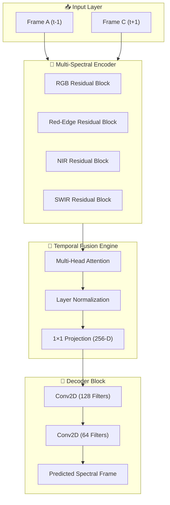

# SpectraVision: AI-Driven Multispectral Satellite Imagery Synthesis by Aphelion

SpectraVision is a custom deep-learning pipeline designed for **Bharatiya Antariksh Hackathon 2026**.  
This project solves the persistent issue of satellite data gaps (due to cloud cover or revisit rates) by generating high-fidelity predicted spectral frames using a time-series triplet approach.

---

## 🚀 Architecture Overview

Our model, **SpectraFlow-Net**, utilizes a specialized architecture for multispectral reconstruction.


---

## 🛠 Key Features

- **10-Band Reconstruction:** Processes Sentinel-2 harmonized SR data, maintaining spectral consistency across NIR, Red-Edge, and SWIR bands.

- **Temporal Cross-Attention:** Uses a custom Multi-Head Attention layer to fuse spatial features from past and future frames to predict the temporal gap.

- **Physics-Aware Validation:** Training pipeline utilizes scientific metrics to ensure the generated imagery is suitable for environmental indices like NDVI and NDWI.

---

## 📊 Validation Metrics

Our model performance is evaluated using three industry-standard quantitative metrics:

| Metric | Purpose | Importance |
|--------|---------|------------|
| **SSIM** | Structural Similarity Index | Ensures farm boundaries and road networks retain their structure |
| **PSNR** | Peak Signal-to-Noise Ratio | Measures pixel-level reconstruction accuracy to reduce noise |
| **FSIM** | Feature Similarity Index | Preserves edge information for precise agricultural mapping |

---

## 🚀 Quick Start

### 1. Prerequisites
Ensure you have **Python 3.10+** and TensorFlow installed:

```bash
pip install tensorflow numpy matplotlib scikit-image
```

---

### 2. Data Acquisition
Use our GEE script to download triplets:

```bash
python download_sentinel2_triplet.py
```

---

### 3. Inference
Run the visualization script to generate predictions and calculate metrics:

```bash
python visualize_prediction.py
```

---

## 📌 Applications

- Agricultural Monitoring  
- Crop Health Analysis  
- Land Cover Mapping  
- Environmental Change Detection  
- Disaster Response Planning  

---

## 👨‍💻 Team

Developed for **ISRO Hackathon 2026**
**Amogha Karanth Uchila**
JSS Academy of technical Education / IIT Madras

**Atharva Joshi**
JSS Academy of Technical Education

**Anubhab Choudhury**
JSS Academy of Technical Education

**Harsh Raj Singh**
JSS Academy of Technical Education

__**Team Aphelion**__
